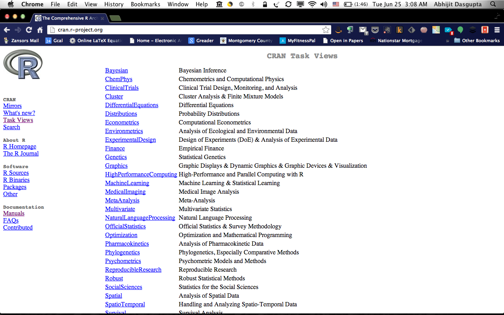

### Abhijit Dasgupta, PhD

Abhijit Dasgupta, PhD is an experienced biostatician and data scientist with
over 20 years experience consulting in biomedical research, bioinformatics, 
business and bioengineering. Maintains an active research portfolio at the 
crossroads of statistics and machine learning, with over 40 peer-reviewed publications.
Has over 18  years experience in R, alongside other 
statistical computing tools like SAS, Stata, Python and Matlab. Provides end-to-end 
consulting, including study design, analysis plans, data munging, visualization,
modeling, prediction, reporting, presenting and grant writing. <br/>
A board member of Data Community DC, he coordinates the <u>Statistical Programming DC</u> meetup group

### DataXtract, LLC

DataXtract, LLC is a Data Science consultancy providing data
mining and analysis, visualization, modeling, statistical computing
and R training services to a broad range of clients.

--- &twocol

## Agenda

*** left

### Part One (R)
1. Setup and introductions
2. Getting R and RStudio up and running
3. An overview of R
4. Data input and output
4. Visualization
5. Modeling
6. Q & A and examples

*** right

### Part Two (Python/R/MySQL)
1. Setting up Python, R and MySQL to interact
2. Using Python as glue
3. Examples

---

## Expectations

### What to expect
+ Overview of R and how to get started with analytics using R
+ Hands-on examples
+ A launching pad for your adoption and use of R

### What <u>not</u> to expect
+ A comprehensive, all-encompassing description of R
+ Covering everything R can do

--- 
## The way forward from here
### Use R for as many projects as possible
### Work through the "steep" learning curve
### Use available resources both within R and online

--- &twocol

## Working environment

*** left

### R
+ R 3.0.1 
  + Almost everything backward compatible to R 2.14.*
+ RStudio
+ Several packages
  + Install and load into your working environment using `initialize.R`

*** right

### Python
+ Python 2.7
+ Complete scientific Python distributions
  + Anaconda (preferred)
  + Enthought
+ Packages
  + numpy, scipy, pandas, matplotlib, rpy2(?), pyRserve, sqlalchemy


---

## RStudio

</img>

---

## RStudio

+ RStudio is an open-source Integrated Development Environment (IDE)
for R
+ RStudio is <u>not</u> a GUI
+ Many features to aid R development
+ <u> Shameless plug: </u> I'm writing a RStudio Cookbook

<div style='background-color:lightgrey'>
<h3>Keyboard shortcuts</h3>
<ul>
<li> Alt-dash inserts <-
<li> Ctrl-1 moves cursor to source window
<li> Ctrl-2 moves cursor to console
<li> Ctrl-Enter sends current line/highlighted code to console
<li> Ctrl-L clears the console
</ul>
</div>

--- .segue .dark

</img>

---

## What is R?

The 18th letter of the alphabet

---

## What is R?

> + The premier open-source statistical software platform
> + A platform for developing new statistical algorithms
> + A platform which is extensible
    + C, C++, Fortran
> + A platform with over 4500 user-contributed packages

--- .quote .nobackground .dark .segue

<q>
R is the <u>lingua statistica</u>
</q>
  <p style='text-align:right'> -- Anthony Damico</p>

--- .quote .nobackground .segue .dark
<q> The question is not <u>if</u> R can do it, but <u>how</u></q>
<p style='text-align:right;'>-- Douglas Bates</p>

---
## Why R?

+ R is free (more specifically GPL3)
+ R is powerful, flexible and often cutting-edge
+ R can be accessed from SAS, SPSS, Stata, Python, Java
+ Interfaces to R are available for Oracle, SAP HANA, Teradata, Netezza, Greenplum

---
## Why R?

+ Standard and cutting-edge statistical modeling
+ Flexible data munging
+ High-quality visualizations
+ Reproducible and automated reporting
+ Increasingly, web-based content-rich graphics

--- .segue .dark

## Let's get started

---

## Where are we?

+ The first thing you want to do is contain all your project-related scripts in a folder
+ All the R data files will be in this folder

```r
getwd() # What is the current working directory?
setwd() # Set the working directory
```

### What's here?

```r
dir()       # shows files in current directory
file.path() # creates a file path string
ls()        # Shows objects in the current session
```
<div style="background-color:lightgrey;">
<p>
RStudio allows you to create "Projects" which hold everything nicely
together along with Git functionality, if desired</p>
</div>

---
## Banging head on wall???

### Within R

+ `help` or `?`
  + `help(data.frame)` or `?data.frame`

### Online
+ Stack Overflow: r tag
+ Twitter: #rstats
+ R-Bloggers.com

---

## Some tips on R coding

+ The R Style Guide by Google
+ Comment character `#` can be placed at the beginning or at the right of code
+ Statements are ended with return or semicolon (;)
+ Names in R are quite liberal but it is recommended that you use common naming conventions
  + First character letter, followed by letters, digits, underscores or periods
  + Note that the period has some special meaning and is used often in R naming to separate object names (e.g. customer.name)
  + It is recommended that variable names use underscores instead of dots especially when combining with databases


---

## Data structures in R

+ In R, _everything_ is an object 
  + All objects have a class
  + All objects have a name
  + Objects are created or changed through assignment operators
+ An object’s class reflects what you can do with the object and the type and extent of information it contains
+ Objects can be passed into functions as a parameter

---

## Assignments

+ `x <- 1:5` or `x <- c(1,3,5,6)`: **integer**
+ `x <- 3.6` or `x <- c(2.5,4.3,9.9)`: **numeric**

+ Basic atomic types are `integer`, `numeric`, `character`, 
`complex`, `logical`, `date`
+ Vectors are 1-dimensional objects of same atomic type. R prefers vectors 

```r
v <- c(1,4,6,7.6)
```

+ Matrices are 2-dimensional objects of same atomic type

```r
A <- matrix(0, nrow=4, ncol=6)
B <- matrix(c(1,3,5,7,9,11,13,15,17,19), nrow=2, byrow=T)
```

---

## Matrices

+ R is fundamentally a matrix-driven language like MATLAB.
+ R has a variety of matrix manipulation functions

```r
nrow(A)
ncol(A)
A[1,]            # First row of A
A[,2]            # Second column of A
A[3,4]           # (3,4) element of A
A[1:2, c(2,5,6)] # a submatrix of A
A %*% B          # matrix multiplication
```

+ R starts counting at 1, not 0

---
## Matrices

+ Some more functions

```r
det(A)
solve(A) # Gives matrix inverse
solve(A,b) # Solves equation Ax=b
eigen(A)
svd(A)
```

+ R can be compiled with high-performance LAPACK and BLAS linear algebra
libraries

---

## The `data.frame` object

+ The `data.frame` is a special form of a `list`
+ A `list` is a data structure that can contain heterogeneous types of data

```r
L <- list(a=1:3, b=c('rhino','bear'), c = matrix(c(1,2,3,4),nrow=2))
```

---
## The `data.frame` object

+ The `data.frame` is the workhorse of R
+ A `data.frame` is essentially a list of vectors of the same length
  + Each vector may be of a different type
+ A `data.frame` is represented as a table, with columns being the vectors
+ Think of a `data.frame` as a collection of variables
+ You can manipulate a `data.frame` like a matrix
  + `D[1,]` or `D[,1:2]`
  + It is <u>not</u> a matrix
+ You can extract variables 
  + `D$index` or `D[,'index']` (recall data frames have columnar representation)
+ Data frames act like SQL tables
  + You can join them (`merge`) and append to them (`cbind`, `rbind`)

---

## The `factor` type

+ Factors are R's representation of categorical variables
+ Factors look like vectors of characters, but they are not!!

```r
gender = factor(c('M','M','F','M','F','F','F'))
levels(gender)
is.factor(gender)
is.character(gender)
as.numeric(gender)
```
+ Internally, factors are represented as integers, with each 
integer corresponding to a level of the categorical variable

---
## Functions

Functions in R have the syntax

```r
functionname <- function(inp1, inp2=3, ...){

  statements
  
  return(list of output objects)

}
```

+ If the `return` statement is absent, the function returns the last 
object created.
+ `...` signifies optional parameters
+ You would use this as `results <- functionname(inp1=x, inp2=4, inp3=9)`
+ Functions are objects

---

## The R REPL

+ R's console is a REPL (read-eval-print loop)
+ You can type commands directly into the console
+ Entering an object name prints out the object's value

```{r echo=TRUE, results='markup'}
a <- 1
a
```

---
## The R REPL

+ R's console is a REPL (read-eval-print loop)
+ You can type commands directly into the console
+ Entering an object name prints out the object's value

```{r echo=TRUE, results='markup'}
dir
```

---
## The R REPL


```{r echo=TRUE, results='markup'}
L <- list(a=c(1,3,4,6), 
          b = c('Adam','Eve'), 
          c = matrix(c(1,2,3,4),nrow=2))
L

```

---
## R packages

+ R has over 5000 packages contributed by users
  + CRAN (general)
  + Bioconductor (bioinformatics)
  + Omegahat (interfaces)
+ Packages make our lives simpler
  + Stand on the shoulders of giants (or simply, people)
+ <b>Conventions:</b> `Hmisc::describe` is the object `describe` in the package `Hmisc`
+ Packages are loaded into the current session using `library(pkgname)` or `require(pkgname)`

--- .segue .dark

## Getting started with data

---
## Importing data

+ <b>Delimited data</b> with comma, tab, pipe using `read.table`, `read.csv`, `read.delim`
+ <b>Fixed width</b> with `read.fwf`
+ <b>Excel</b> with `gdata::read.xls`, `XLConnect::readWorksheet`, `xlsx::read.xlsx`
+ <b>SAS</b> with `Hmisc::sas.get`, `foreign:read.ssd` (both requiring SAS), `sas7bdat::read.sas7bdat` (for Windows sas7bdat files), or via conversion to Stata `.dta` files
+ <b>SPSS</b> with `foreign::read.sav`
+ <b>Stata</b> with `foreign::read.dta`
+ <b> JSON</b> with `rjson::fromJSON`

*** pnotes
+ Note you can read from both local files and URLs 


---
## Importing data

+ <b> Databases </b>
  + `RODBC`/`RJDBC`/`DBI` (general)
  + `sqldf`
  + `RMySQL` (not on Windows)
  + `RMongo`

--- .segue .dark

## Programming 

---

## Conditionals

R has a general `if-else` paradigm available

```r
if(condition) {
  statements
} else if {
  statements
} else {
  statements
}
```
Conditions include equality (`==`), inequalities (`<` or `<=`), or (`|`), and (`&`) and negation (`!`)
<p>
If the conditional only applies to a vector, R provides a `ifelse` function:
```r
x <- ifelse(y > 0, 'Positive','Negative')
```

---
## Loops

R provides

+ `for` loops
+ `while` loops
+ `repeat` loops

```r
for(i in 1:25){
  y[i] <- 3*x[i]+5
}

for(u in letters){
  print(u)
}
```

It is better to avoid explicit looping, if possible

---
## 'Apply'ing yourself

R provides a set of "apply" functions:
+ `apply` works on arrays 

```r
apply(X,1, mean)  # Mean of the rows
apply(X, 2, sd)   # Std. Dev. of the columns
```
+ `lapply` works on lists
  + It also works on `data.frame` objects, by column

```r
lapply(L, FUN) # applies FUN to every element of L
```

+ `sapply` is `lapply` with the output simplified

---

### Set operations
```r
union, intersection, %in%, setdiff, setequals
```

### Pattern matching
```r
grep, grepl, regexpr, sub, gsub
```

### Type verification
```r
is.numeric, is.factor, is.list, is.data.frame, is.character
```

### Type conversion
```r
as.numeric, as.factor, as.data.frame, as.character
```

---

## Looking at data frames

```{r}
str(mtcars)
```

---

## Looking at data frames

```{r}
summary(mtcars[,1:4])
```

----
## Looking at data frames

```{r}
library(Hmisc)
Hmisc::describe(mtcars[,1:2])
```

---

## Subsetting

```{r}
subset(mtcars, mpg < 20 & cyl==6)
```

---
## Transforming

```{r}
cars2 <- transform(mtcars,
                   gas = ifelse(mpg>20,'Econ','Guzzler'),
                   kmpg = mpg * 1.6)
```
Note that the original data remains unchanged
```{r}
str(mtcars)
```

---
## Data cleaning

### Missing values
+ Missing values are coded as `NA`
+ R can test for missing values using `is.na`
+ Rows of data frames with complete data can be identified using 
`complete.cases(D)`

### Duplication
+ You can get a set of non-duplicate rows of a data frame using 
`D[!duplicated(D),]`.

---
## Statistical functions

### Probability distributions
```r
beta,binom, cauchy, chisq, xp, f, gamma, geom, 
hyper, lnorm, logis, nbinom, norm, pois, t, 
unif, weibull, wilcox.
```
Each has a random number generator (`rnorm`), a density function (`dnorm`), a quantile function (`qnorm`) and a probability function (`pnorm`)

### Statistical tests
```r
t.test, wilcox.test, chisq.test, prop.test
```

---
## Aggregation
We will use the package `plyr` for demonstration. The general format is 

```r
ddply(data frame, spliting variables, function, function arguments)
```
```{r}
avg.by.cyl.gear <- ddply(mtcars, ~cyl + gear, summarise, mean.mpg = mean(mpg, 
    na.rm = T), median.mpg = median(mpg, na.rm = T))
avg.by.cyl.gear
```

---
## Aggregation

`plyr` has a set of functions of the form `(x)(y)ply` where `(x)` and `(y)` can be `d`,`l`, or `a`.`(x)` is the class of the input object and 
`(y)` is the class of the output object, among `data.frame`, `list` and `array`

|      Input       |  data.frame  |  list  |  array  |
|:----------------:|:------------:|:------:|:-------:|
|  **data.frame**  |    ddply     | ldply  |  adply  |
|     **list**     |    dlply     | llply  |  alply  |
|    **array**     |    daply     | laply  |  aaply  |

---
## Splitting

```{r}
library(plyr)
cars2 <- subset(mtcars, mpg<20)
dlply(cars2,~cyl)
```

## Modeling

### The formula interface

R has a `formula` object which is a representation of a formula specifying
the relationship between a dependent variable and independent variables

+ <b> Basic formula:</b> `y ~ a + b`
+ <b>Interactions:</b> `y~ a + b + a:b` or `y ~ a*b`
+ <b>Including transformations:</b> `y ~ a + sqrt(b)`

Factors are implicitly handled correctly

---
## Models

### Classical models

+ <b>Linear models:</b> `lm`
+ <b>Generalized linear models:</b> `glm`
+ <b>Mixed effects models:</b> `lme4::lmer` or `nlme::lme`

### Machine learning

+ <b>Random Forest:</b> `randomForest::randomForest`
+ <b>Decision trees:</b> `rpart::rpart`
+ <b>Neural Networks:</b> `caret::nnet`
+ <b>Lasso:</b> `lars::lars`

---

## Visualization

R has two basic libraries of graphics
+ Base graphics
+ grid graphics
  + `ggplot2`
  + `lattice`

--- &twocol
## Visualization

*** left

### Base graphics

```r
par(mfrow=c(2,2))
plot(mpg~disp, data=mtcars)
boxplot(mpg~factor(cyl), data=mtcars)
hist(mtcars$mpg)
```

*** right

```{r,echo=FALSE }
par(mfrow=c(2,2))
plot(mpg~disp, data=mtcars)
boxplot(mpg~factor(cyl), data=mtcars)
hist(mtcars$mpg)

```

--- &twocol

## Visualization

*** left

### ggplot

```r
library(ggplot2)
ggplot(mtcars, aes(x=disp,y=mpg))+
  geom_point()
ggplot(mtcars, aes(x=factor(cyl),y=mpg))+
  geom_boxplot()
ggplot(mtcars, aes(x=mpg))+geom_histogram()
```

*** right

```{r, echo=FALSE, results='hide',warning=FALSE, error=FALSE, message=FALSE}
library(ggplot2)
library(gridExtra)
p1 <- ggplot(mtcars, aes(x=disp, y=mpg))+geom_point()
p2 <- ggplot(mtcars, aes(x=factor(cyl), y=mpg))+
  geom_boxplot()
p3 <- ggplot(mtcars, aes(x=mpg))+geom_histogram()
plt <- grid.arrange(p1,p2,p3, nrow=2, ncol=2)
print(plt)
```

---

## Visualization

```{r, results='hide', fig.height=4, fig.align='center'}
plt <- ggplot(mtcars, aes(x=disp, y=mpg))+geom_point()+
  facet_wrap(~cyl, nrow=1)
print(plt)
```

---
</img>

--- .segue

## Thank you!!

Abhijit Dasgupta, PhD<br/>
abhijit@dataxtract.com<br/>
@webbedfeet<br/>
(301) 385-3067
